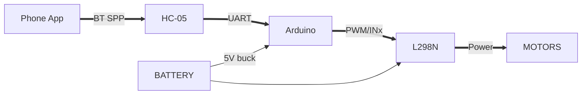

---

---
title: "Beginner Approach — Fun-First RC Robot"
description: "Start with a remote-controlled robot and learn embedded systems basics — PWM, UART, Bluetooth, and motor control — the fun way!"
layout: default
---

----------------------------------------------------------------------------------------

# Beginner Approach (Fun‑First): Build a Remote‑Controlled Robot 🛠️🤖

*Goal:* Make something that moves, blinks, and obeys you — while quietly learning motors, PWM, UART/Bluetooth, and microcontroller basics.

> Promise: zero interview stress, maximum tinkering joy. You’ll still learn real skills used in embedded jobs — we just hide the broccoli in the pizza.

---

## What you’ll build

A 2‑wheel differential‑drive robot that you can steer from your phone via Bluetooth. Speed with **PWM**, direction with an **H‑bridge (L298N)**, and commands via **UART** to an **Arduino**.

---

## Bill of Materials (BoM)

* Chassis: acrylic/metal 2‑WD kit with caster wheel
* Motors: 2× DC gear motors (typically **6 V, 100–300 RPM**)
* Wheels: matched to motors
* Motor driver: **L298N** dual H‑bridge module (with onboard 5 V regulator)
* MCU: **Arduino Uno/Nano** (Nano is tiny and adorable)
* Power:

  * **Battery A (Motors):** 2‑cell Li‑ion/LiPo (7.4 V) *or* 4×AA NiMH pack (≈4.8–6 V)
  * **Battery B (Logic):** 9 V is *not* recommended; prefer a small **power bank (5 V)** or buck converter from the motor battery → **5 V** for Arduino
* Bluetooth: **HC‑05** (classic BT SPP)
* Misc: toggle switch, wires (18–22 AWG), 470 µF electrolytic + 100 nF ceramics (decoupling),
  standoffs, breadboard (optional)
* Optional: LED strip (style points), buzzer (victory beeps), on/off neon sticker (serious style points)

> ⚠️ Safety: LiPo batteries bite. Use a fuse (1–3 A), don’t short, and mind polarity.

---

## Phase 0 — Touch a Motor (No MCU, no fear)

**Objective:** Feel what voltage and current *mean*.

1. Connect **battery → motor** briefly. Note spin direction.
2. Reverse the leads → direction flips. That’s differential drive in one gesture.
3. Try lower voltage (e.g., 3.7 V cell) vs higher voltage (7.4 V) and feel torque/speed change.

**Takeaways**

* DC motor speed ≈ voltage; torque ≈ current.
* Reversing polarity reverses direction. (We’ll automate this with an H‑bridge.)

---

## Phase 1 — Meet the H‑Bridge (L298N)

The **L298N** is a dual H‑bridge that lets a low‑power brain control a high‑power motor.

**L298N pins (per motor channel)**

* **IN1/IN2**: logic inputs (set direction)
* **ENA**: enable (can be PWM for speed)
* **OUT1/OUT2**: to motor terminals
* **12V (V_s)**: motor supply (up to ~35 V; real world ~7–12 V)
* **5V**: onboard regulator (may power Arduino *sparingly*; safer to power Arduino separately)
* **GND**: common ground with Arduino (this is not optional)

**Truth table (one channel)**

* IN1=1, IN2=0 → Forward
* IN1=0, IN2=1 → Reverse
* IN1=IN2 → Brake/Coast
* ENA PWM → Speed control (0–255 on Arduino)

> Mini‑humour: The L298N is the gym trainer for your motors. Arduino gives instructions; L298N does the heavy lifting and occasionally yells.

---

## Phase 2 — Brain Onboard (Arduino + Wiring)

**Arduino pins (example mapping)**

* **Left motor:** ENA→D5 (PWM), IN1→D8, IN2→D9
* **Right motor:** ENB→D6 (PWM), IN3→D10, IN4→D11
* **Bluetooth (HC‑05):** RX↔TX (via voltage divider to HC‑05 RX), TX↔RX; or use **SoftwareSerial** on D2/D3
* **Power:** Battery → L298N **V_s** (motors); Arduino **5 V** from buck regulator; **GND common**

**Power architecture**

* Keep **motor power** and **logic power** separate or well‑regulated.
* Join **grounds** (L298N GND ↔ Arduino GND ↔ HC‑05 GND).
* Add a **470 µF** cap across motor supply terminals + **100 nF** near logic Vcc.

---

## Phase 3 — PWM for Speed (with Direction Control)

**Concept:** PWM = Pulse‑Width Modulation. Duty cycle controls average voltage → speed.

```c
// Arduino sketch: Basic PWM + Direction (no Bluetooth)
const int ENA = 5, IN1 = 8, IN2 = 9;   // Left
const int ENB = 6, IN3 = 10, IN4 = 11; // Right

void setup(){
  pinMode(ENA, OUTPUT); pinMode(IN1, OUTPUT); pinMode(IN2, OUTPUT);
  pinMode(ENB, OUTPUT); pinMode(IN3, OUTPUT); pinMode(IN4, OUTPUT);
}

void drive(int leftPWM, int rightPWM){
  // Direction from sign; magnitude is speed 0..255
  auto setMotor = [](int EN, int A, int B, int val){
    int speed = abs(val);
    digitalWrite(A, val >= 0 ? HIGH : LOW);
    digitalWrite(B, val >= 0 ? LOW  : HIGH);
    analogWrite(EN, constrain(speed, 0, 255));
  };
  setMotor(ENA, IN1, IN2, leftPWM);
  setMotor(ENB, IN3, IN4, rightPWM);
}

void loop(){
  drive(200,200); delay(1000); // forward medium
  drive(-200,-200); delay(1000); // reverse
  drive(255,180); delay(800); // slight right arc
  drive(0,0); delay(1000); // brake
}
```

**Observations**

* Higher duty → faster spin.
* Mismatched left/right PWM → turns/arcs.

---

## Phase 4 — Talk to Me (UART + Bluetooth HC‑05)

**HC‑05** is a classic Bluetooth SPP module → appears as a serial COM port to your phone.

**Pairing**

1. Power HC‑05 (5 V) → LED blinks fast.
2. Pair from phone (default PIN **1234** or **0000**).
3. Use an app like **Serial Bluetooth Terminal** (Android) or a simple custom app.

**Wiring tips**

* Arduino **TX→HC‑05 RX** (OK at 5 V on many modules; safer with 1 K/2 K divider)
* Arduino **RX←HC‑05 TX** (3.3 V logic; Arduino reads fine)
* Default baud = **9600** (AT mode is 38400 by default)

**Command Protocol (simple & robust)**

* Single letters with optional speed value 0–255, newline‑terminated:

  * `F120` → forward @120
  * `B200` → back @200
  * `L150`, `R150` → turn
  * `S` → stop
  * `X` → beep or lights (for the vibes)

**Arduino code (Bluetooth control)**

```c
#include <SoftwareSerial.h>
SoftwareSerial BT(2,3); // RX, TX (to HC-05 TX,RX)

const int ENA=5, IN1=8, IN2=9;
const int ENB=6, IN3=10, IN4=11;

void setMotor(int EN,int A,int B,int val){
  int s = constrain(abs(val),0,255);
  digitalWrite(A, val>=0?HIGH:LOW);
  digitalWrite(B, val>=0?LOW:HIGH);
  analogWrite(EN, s);
}

void driveLR(int L,int R){ setMotor(ENA,IN1,IN2,L); setMotor(ENB,IN3,IN4,R);}

void setup(){
  pinMode(ENA,OUTPUT); pinMode(IN1,OUTPUT); pinMode(IN2,OUTPUT);
  pinMode(ENB,OUTPUT); pinMode(IN3,OUTPUT); pinMode(IN4,OUTPUT);
  BT.begin(9600);
}

String buf="";

void loop(){
  while(BT.available()){
    char c=BT.read();
    if(c=='\n' || c=='\r'){
      handleCmd(buf); buf="";
    } else if(isAscii(c)) buf+=c;
  }
}

void handleCmd(String s){
  if(s.length()==0) return;
  char cmd = toupper(s[0]);
  int val = 150; // default speed
  if(s.length()>1) val = constrain(s.substring(1).toInt(),0,255);

  switch(cmd){
    case 'F': driveLR(val, val); break;
    case 'B': driveLR(-val,-val); break;
    case 'L': driveLR(-val, val); break;
    case 'R': driveLR( val,-val); break;
    case 'S': driveLR(0,0); break;
    case 'X': tone(4, 880, 150); break; // buzzer on D4 (optional)
    default: /* ignore */ break;
  }
}
```

> Pro‑tip: Echo back a small acknowledgment over BT (e.g., `OK F120`). It makes debugging feel like texting your robot.

---

## Phase 5 — Phone App (3 options)

1. **Serial Bluetooth Terminal (Android)** — quickest. Type commands or define macro buttons.
2. **MIT App Inventor** — drag‑drop a controller UI (joystick/buttons) that sends text like `F180\n`.
3. **Custom Flutter/React Native app** — overkill for day‑1; perfect for a weekend brag.

**UI ideas**

* Big arrows: ▲ ▼ ◀ ▶ mapped to F/B/L/R at chosen speeds.
* Slider for speed (0–255). Send on change or on release.
* Panic button = `S` (stop). Make it huge and red. Because walls.

---

## Phase 6 — Make It Drive Straight (Calibration)

Because no two motors are twins.

* Place robot on floor, send `F180`. Observe drift.
* If it veers right, left motor is weaker → increase left PWM: `LBOOST = +10..30`.
* Add a simple calibration factor:

```c
int calL = 0, calR = 0; // tweak live over BT with +L10, +R-8, etc.
void driveLRcal(int L, int R){ driveLR(L+calL, R+calR); }
```

Stretch: add wheel **encoders** later for closed‑loop speed control (PID). For now, seat‑of‑pants tuning is part of the fun.

---

## Phase 7 — Power & Noise (a tiny EE detour)

* **Grounding:** Single common ground star‑point near the driver.
* **Decoupling:** 470 µF across motor supply; 100 nF near Arduino Vcc/HC‑05.
* **Flyback:** L298N has internal diodes, but extra diodes across motors never hurt.
* **Brownouts:** If Arduino keeps resetting → separate logic supply or add a buck converter and a big cap.
* **Thermals:** L298N ≈ 2 V drop; gets warm. Stick a heatsink; keep motor currents ≤2 A.

---

## Phase 8 — Mechanical Tips

* Keep heavy battery low and centered.
* Cable‑tie everything. Vibrations are a thing.
* Wheel grub‑screws must actually touch the flat on the shaft. (Ask me how I learned this.)

---

## Debugging Checklist 🧰

* **Won’t move:** GND common? ENA/ENB actually wired to PWM pins? L298N 12 V present?
* **Moves wrong way:** Swap IN1/IN2 for that motor or flip sign in code.
* **BT pairs but no response:** Baud mismatch; try 9600. Check RX level shifting.
* **Resets on throttle:** Add big cap; separate supplies; check for shorts.

---

## Skills You Secretly Learned 🎓

* **PWM** for speed control
* **H‑bridge** logic for direction & braking
* **UART** serial comms
* **Bluetooth SPP** basics (pairing, baud, app)
* **Power integrity** (decoupling, grounding, brownouts)
* **Embedded C** coding patterns (command parser, mapping inputs→actuators)

> See? Pizza with broccoli. You barely noticed.

---

## Stretch Goals (Weekend Boss Mode)

* Add **RGB underglow** (WS2812) → drive with a command `LED R255 G64 B0`
* Mount a **buzzer** for backing‑up beeps when reversing
* Add an **ultrasonic sensor** (HC‑SR04) for auto‑stop if obstacle < 20 cm
* Swap L298N → **TB6612FNG** (more efficient, cooler)
* Replace HC‑05 with **ESP32** (BT + Wi‑Fi, OTA, web UI)

---

## Wiring Overview (Text Diagram)

```
Battery (7.4V) ── Switch ── L298N Vs
                          │
                          ├── OUT1/OUT2 → Left Motor
                          └── OUT3/OUT4 → Right Motor

Arduino 5V (from buck) → Arduino Vcc
GND (common) ───────────┬─ L298N GND
                        ├─ Arduino GND
                        └─ HC‑05 GND

Arduino D5 → ENA (PWM)   Arduino D6 → ENB (PWM)
Arduino D8 → IN1         Arduino D9 → IN2
Arduino D10 → IN3        Arduino D11 → IN4
Arduino D2 (RX) ← HC‑05 TX
Arduino D3 (TX) → HC‑05 RX (via divider 2k:1k)
```

---

## (Optional) Mermaid Block Diagrams



```mermaid
sequenceDiagram
  participant User
  participant App
  participant HC05 as HC‑05
  participant AVR as Arduino
  participant Driver as L298N
  participant M1 as Motor L
  participant M2 as Motor R

  User->>App: Tap Forward @180
  App->>HC05: "F180\n" (Bluetooth SPP)
  HC05->>AVR: UART bytes
  AVR->>Driver: IN1=1,IN2=0; ENA=PWM(180)
  AVR->>Driver: IN3=1,IN4=0; ENB=PWM(180)
  Driver->>M1: Current flows + PWM
  Driver->>M2: Current flows + PWM
```

---

## Images (placeholders + generator prompts)

* **Wiring overview photo:** take a clean top‑down shot. Add labels.
* **Chassis glamour shot:** outdoor light = instant pro.

**AI prompt for a clean illustration:**

> “Top‑down vector illustration of a 2‑wheel Arduino robot with L298N driver and HC‑05 Bluetooth, labeled connections (ENA/ENB, IN1..IN4, RX/TX), minimal dark theme, neon accents, flat‑tech style, high resolution.”

**AI prompt for a playful poster:**

> “Cute RC robot poster, bright colors, fun typography, ‘Controlled Chaos: Learn PWM, UART & Bluetooth by driving a robot’, clean layout, high contrast, minimal text.”

---

## Downloadables (to add later)

* STL files for mounts, a printable wiring card, and a one‑page cheat sheet.

---

## FAQ

**Q: Can I power Arduino from L298N 5 V pin?**
A: Only if motor current is modest and the board’s regulator is stable. Safer to use a buck.

**Q: My HC‑05 RX is 3.3 V — will 5 V TX kill it?**
A: Many modules survive, but use a divider (2 k/1 k) because we like our modules alive.

**Q: Why does my robot drift?**
A: Motor tolerances + friction. Calibrate PWM or add encoders for closed loop.

---

### You’re done!

You built an RC robot, learned PWM/UART/H‑bridge/power basics, and didn’t have to say “data structure” once. Next up: add sensors or swap Arduino for ESP32 and go wireless‑web with a joystick page.
